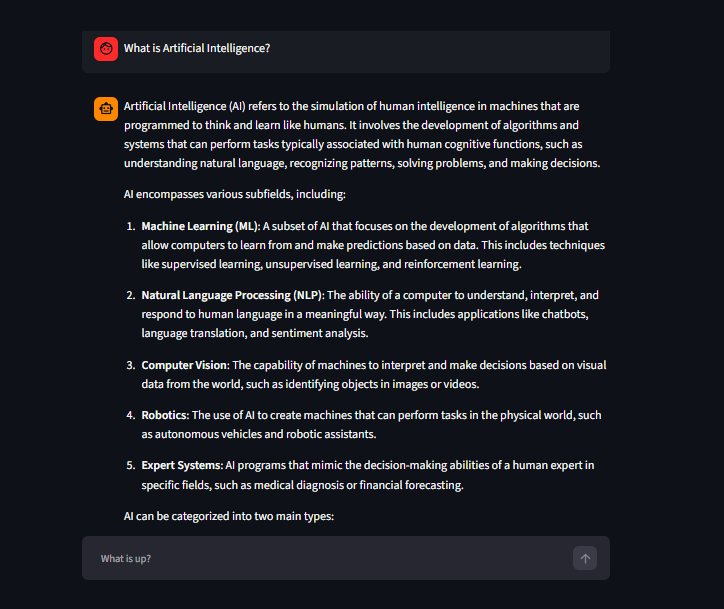

# OpenAI Streamlit Chatbot

A ChatGPT-like conversational chatbot built using **Python, Streamlit, and the OpenAI API**. The application allows users to interact with an AI model through a simple web-based chat interface with streaming responses and conversation history.

## 📸 Application Screenshot



## 🚀 Features

* Interactive ChatGPT-like user interface
* AI-powered responses using OpenAI API
* Real-time streaming responses
* Conversation history using Streamlit session state
* Simple and user-friendly interface
* Secure API key configuration using environment variables

## 🛠️ Technologies Used

* Python
* Streamlit
* OpenAI API
* python-dotenv

## 📂 Project Structure

```text
openai_streamlit_chatbot/
│
├── 4_chatbot_OpenAI.py
├── .env
├── .gitignore
├── requirements.txt
├── README.md
│
└── screenshots/
    └── chatbot.png
```

## ⚙️ Installation and Setup

### 1. Clone the repository

```bash
git clone https://github.com/YOUR_USERNAME/openai_streamlit_chatbot.git
```

### 2. Navigate to the project folder

```bash
cd openai_streamlit_chatbot
```

### 3. Create a virtual environment

```bash
python -m venv venv
```

### 4. Activate the virtual environment

**Windows PowerShell:**

```powershell
.\venv\Scripts\Activate.ps1
```

### 5. Install dependencies

```bash
pip install -r requirements.txt
```

### 6. Configure your OpenAI API key

Create a `.env` file in the project root directory:

```env
OPENAI_API_KEY=your_openai_api_key
```

Replace `your_openai_api_key` with your actual API key.

Get your API key from the [OpenAI API Platform](https://platform.openai.com/api-keys).

**Note:** Keep your API key private. Never upload your `.env` file to GitHub.

### 7. Run the application

```bash
python -m streamlit run 4_chatbot_OpenAI.py
```

Open the local URL displayed in your terminal, usually:

```text
http://localhost:8501
```

## 💬 How to Use

1. Start the Streamlit application.
2. Enter your question in the chat input box.
3. Press Enter to submit your message.
4. View the AI-generated response.
5. Continue the conversation using the same chat interface.

## 🧠 Model

This project uses the OpenAI model:

```text
gpt-4o-mini
```

The model is configured in the application using Streamlit session state.

## 🔐 Security

* API keys are stored in environment variables.
* The `.env` file is excluded from version control.
* Never commit secret keys or credentials to a public repository.

## ⚠️ Important Note

OpenAI API access and usage may require separate billing or credits. API charges may apply depending on usage.

## 🔮 Future Improvements

* Multiple conversation management
* Clear chat functionality
* Chat export and download
* Customizable model selection
* Improved UI and responsive design

## 👩‍💻 Author

**Shivani Patil**
